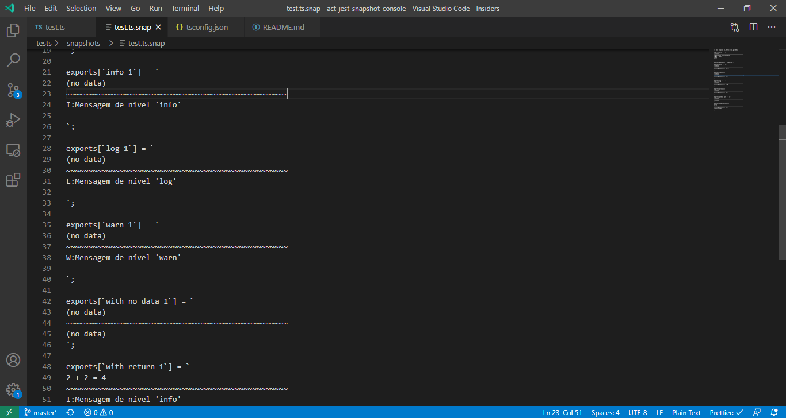

# AC Ferramentas: JEST - instantâneo de console (NodeJS)

[](https://www.travis-ci.org/github/brodao/act-jest-snapshot-console)
[](https://codecov.io/gh/brodao/act-jest-snapshot-console)
[](https://creativecommons.org/licenses/by/4.0/)

<!-- ALL-CONTRIBUTORS-BADGE:START - Do not remove or modify this section -->

[](#contributors)

<!-- ALL-CONTRIBUTORS-BADGE:END -->

## Objetivo

Captura a saída de `console.log()` e incorpora-o ao instantâneo de um teste baseado em JEST.



## Instalação

```terminal
npm install --save-dev act-jest-snapshot-console
```

## Uso

Em _package.json_, configure o :

```terminal
...
  },
	"jest": {
		...,
		"snapshotSerializers": [
			"act-jest-snapshot-console"
		]
	},
	...
```

Nos testes:

```javascript
const { wrap } = require('act-jest-snapshot-console');
...
function myFuncToTest() {
  console.log("Executando myFuncToTest")
}
...
test('before', () => {
  expect(myFuncToTest).toMatchSnapshot();
});

test('after', () => {
  expect(wrap(myFuncToTest)).toMatchSnapshot();
});
```

## Licenciamento

O **AC Ferramentas** é de uso gratuíto por qualquer pessoa e pode ser utilizado em trabalhos com fins comerciais ou não.

A extensão em si, é um sofware de fonte aberto, gratuíto e distribuí­do sob a licença [CC BY-NC-SA](LICENSE).

## Suporte

O suporte é efetuado exclusivamente via chamados e/ou consultando a documentação da ferramenta.

-   [chamados](https://github.com/brodao/act-jest-snapshot-console/issues?status=new&status=open)
-   [documentação](https://github.com/brodao/act-jest-snapshot-console/wiki/)

## Doação

Ajude a manter gratuíto e aberto. Se o que disponibilizamos gratuitamente e de forma aberta esta sendo-lhe útil, considere efetuar uma contribuição por um dos meios indicados.

-   **Mercado Pago** Doação com valor a ser definido por você (vários meios):

    -   [contribuição única](http://mpago.la/1PqKVdx)
    -   [3 contribuições](http://mpago.la/1Gk2N6k)
    -   [6 contribuições](http://mpago.la/28aH7Qa)

-   **PagSeguro** Doação única com valor a ser definido por você (vários meios)
    -   [contribuição única](https://pagseguro.uol.com.br/checkout/nc/nl/donation/sender-identification.jhtml?t=ed1ce6a52728d7cc3f98b07dd597573b7db955e85faff6ff5da31c3d3b58266b&e=true#rmcl)

## <a name=contributors>Colaboradores</a>

> O trabalho é voluntário e não concede nenhum direito/privilégio, incluindo eventuais ganhos pecuniários. Veja [CONTRIBUTING](CONTRIBUTING.MD) para saber mais.

Nossos sinceros agradecimentos vão para:

<!-- ALL-CONTRIBUTORS-LIST:START - Do not remove or modify this section -->
<!-- prettier-ignore-start -->
<!-- markdownlint-disable -->
<table>
  <tr>
    <td align="center"><a href="https://github.com/brodao"><br /><sub><b>Alan Cândido</b></sub></a><br /><a href="https://github.com/brodao/act-jest-snapshot-console/commits?author=brodao" title="Code">💻</a></td>
  </tr>
</table>

<!-- markdownlint-restore -->
<!-- prettier-ignore-end -->

<!-- ALL-CONTRIBUTORS-LIST:END -->

Este projeto segue a especificação [all-contributors](https://github.com/all-contributors/all-contributors).

Contribuições de qualquer tipo são bem-vindas!
